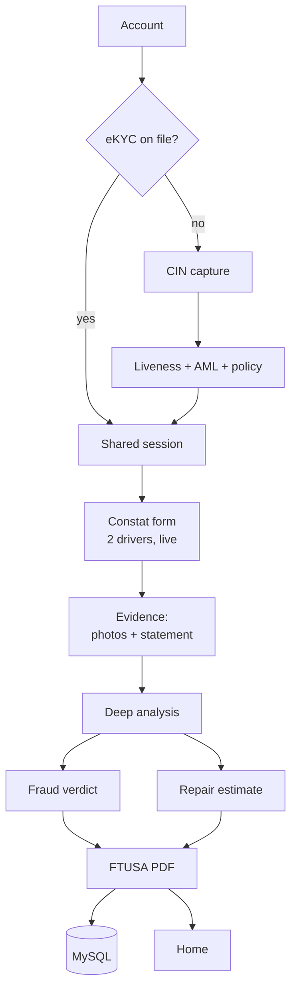
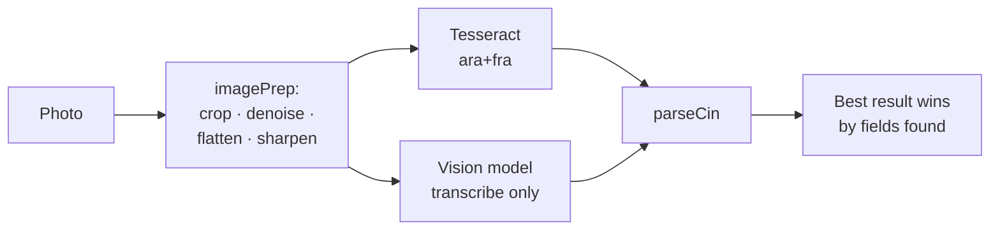
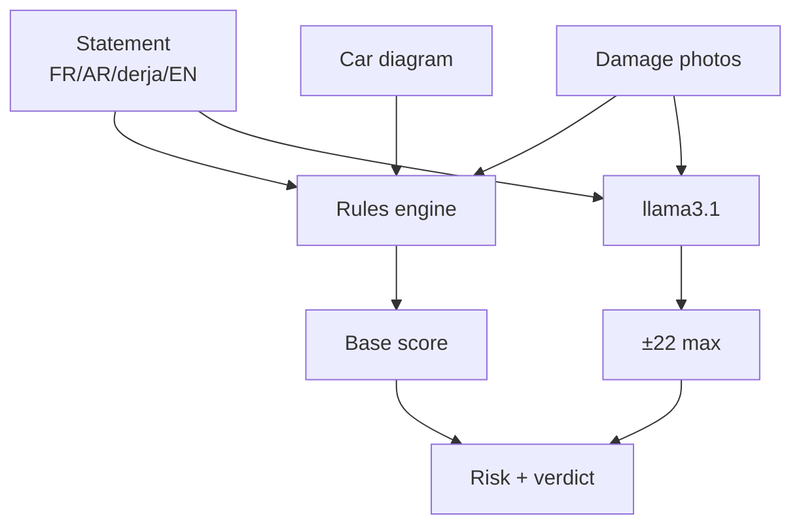

# ASSURINI AI

End-to-end motor accident claims for the Tunisian market: CIN-based eKYC, a shared
live *constat amiable* between two drivers, AI analysis of damage photos and the
driver's story, fraud detection, repair-cost estimation, and a downloadable FTUSA
constat.

Everything runs **locally**. Biometrics execute in the browser, the LLM runs on
Ollama on your machine, the database is a local MySQL. No personal data leaves the
machine.

---

## Contents

1. [Quick start](#quick-start)
2. [Prerequisites](#prerequisites)
3. [Running the app](#running-the-app)
4. [Phone demo over HTTPS](#phone-demo-over-https) ← **read this before demoing**
5. [Using the app](#using-the-app)
6. [Demo script](#demo-script)
7. [Architecture](#architecture)
8. [How the AI works](#how-the-ai-works)
9. [API reference](#api-reference)
10. [Database](#database)
11. [Troubleshooting](#troubleshooting)
12. [Project status and known limits](#project-status-and-known-limits)

---

## Quick start

If everything is already installed:

```bash
npm install      # first time only
npm run dev      # → http://localhost:5173
```

For any demo involving a **phone, camera, microphone or GPS**, you must use
`npm run dev:https` instead — see [Phone demo over HTTPS](#phone-demo-over-https).

MySQL does **not** start automatically when it was installed from a ZIP archive
(no Windows service). Start it first:

```powershell
Start-Process 'C:\Users\elyes\tools\mysql-9.1.0-winx64\bin\mysqld.exe' `
  -ArgumentList '--basedir=C:\Users\elyes\tools\mysql-9.1.0-winx64',
                '--datadir=C:\Users\elyes\tools\mysql-data',
                '--port=3306','--bind-address=127.0.0.1' -WindowStyle Hidden
```

---

## Prerequisites

| Component | Version | Purpose | Required? |
|---|---|---|---|
| Node.js | ≥ 20 (tested on 24.18) | Vite client + Express server | **yes** |
| MySQL | 8+ (tested on 9.1) | case persistence | no — degrades gracefully |
| Ollama + `llama3.1` | 8B | fraud reasoning over the statement | no — falls back to rules |
| Ollama + `qwen2.5vl:3b` | 3B vision | reading the CIN | no — falls back to Tesseract |

### Node.js

Check with `node --version`. Install from [nodejs.org](https://nodejs.org) (LTS), or
unzip the portable archive and add its folder to your user `PATH`.

```bash
npm install
```

The `postinstall` step copies the face-api models into `public/models` automatically.

### MySQL

The app **creates its own database and tables on boot**
(`CREATE DATABASE / TABLE IF NOT EXISTS`) — there is no migration to run.

Configure with environment variables (defaults in parentheses):

```
DB_HOST      (127.0.0.1)
DB_PORT      (3306)
DB_USER      (root)
DB_PASSWORD  (empty)
DB_NAME      (claimpilot)
```

> **If MySQL is missing or stopped, the app still works.** Sealed cases are spooled to
> `.data/pending-writes.json` and replayed automatically once the database is reachable
> again. A demo never dies on a stopped database.

### Ollama

```bash
ollama pull llama3.1        # fraud reasoning — best JSON adherence of the three
ollama pull qwen2.5vl:3b    # CIN reading (~3 GB)
```

`VISION_MODEL` selects the vision model (default `qwen2.5vl:3b`). `qwen2.5vl:7b`
reads noticeably better but is 3–5× slower — measured 9/13 fields vs 6/13, at
34–54 s per side instead of 7–18 s, so it is not the default.

Model selection is automatic, in order: `llama3.1` → `llama3` → `llama3.2`.
Override with `OLLAMA_MODEL=llama3`, host with `OLLAMA_HOST`
(default `http://127.0.0.1:11434`).

> **If Ollama is stopped**, fraud analysis falls back to the deterministic rules engine
> alone and the result is labelled `"rules only"` — never presented as AI analysis that
> did not happen.

---

## Running the app

| Command | What it does |
|---|---|
| `npm run dev` | client `:5173` + server `:8787`, over **http** |
| `npm run dev:https` | same over **self-signed https** — required for phone/camera/mic |
| `npm run dev:client` | Vite client only |
| `npm run dev:server` | Express server only |
| `npm run build` | typecheck (`tsc -b`) + production build |
| `npm run preview` | serve the production build |

The client proxies `/api` and `/ws` to `localhost:8787`, so everything is same-origin
and there is no CORS to configure.

---

## Phone demo over HTTPS

**This is the single easiest thing to get wrong.**

Browsers only expose the **camera**, **microphone**, **geolocation**, `crypto.subtle`
and `crypto.randomUUID` in a *secure context*: `https://` or `localhost`. On
`http://192.168.x.x` those APIs **do not exist** — no permission setting can bring
them back.

```bash
npm run dev:https
```

Then open the **https** LAN address on the phone, e.g.:

```
https://10.20.1.60:5173
```

Accept the certificate warning (**Advanced → Proceed**) — it is self-signed, which is
expected. Both devices must be on the **same Wi-Fi network**.

### Finding the right IP address

A dev machine typically has 5–10 IPv4 addresses (VirtualBox, VMware, Hyper-V, WSL,
TAP…), **none of which a phone can reach**. Naively taking the first one hands out
something like `192.168.56.1` and the QR code silently points nowhere.

`/api/netinfo` scores the candidates and returns the real Wi-Fi/Ethernet interface:

```json
{
  "lanIp": "10.20.1.60",
  "candidates": [
    { "name": "Wi-Fi",                      "address": "10.20.1.60",   "usable": true  },
    { "name": "Ethernet 4",                 "address": "192.168.56.1", "usable": true  },
    { "name": "vEthernet (Default Switch)", "address": "172.24.176.1", "usable": false }
  ]
}
```

If the guess is ever wrong, force it:

```bash
LAN_IP=192.168.1.42 npm run dev:https
```

The session QR encodes this address **using the current page's protocol** — open the
host machine over https and the QR is https too.

### Windows Firewall

On first launch Windows asks whether to allow Node on the network. **Allow it**, ticking
the profile that matches your Wi-Fi. Check which profile that is:

```powershell
Get-NetConnectionProfile | Select-Object Name,InterfaceAlias,NetworkCategory
```

If the rule covers "Public" but your Wi-Fi is "Private" (or vice versa), the phone
cannot connect.

---

## Using the app

### 1. Account and language

On first launch you create a local account (stored in browser `localStorage` — there is
no auth backend). The **AR / FR / EN** language selector is available from the first
screen and switches the whole interface, including RTL layout for Arabic.

### 2. eKYC — identity verification

| Step | What happens |
|---|---|
| CIN capture (front/back) | photograph or upload the national ID card |
| Preprocess | crop to card, denoise, flatten illumination, sharpen |
| Read | Tesseract (`ara+fra`) **and** the local vision model; best result wins |
| Profile form | pre-filled, fully editable — partial reads never block you |
| Liveness | **blink ×2** or **head turn left→right**, detected live on-device |
| Policy | five plans priced for your answers, or decline |
| Signature | draw with finger or mouse |

Once completed, the eKYC is stored against your account and **never asked again**.

All biometrics are **on-device**: models are served from `public/models` and no ID
image is uploaded anywhere.

### 3. Shared accident session — the core feature

One driver **opens a case**, the other **joins it**:

- by scanning the **QR code**, or
- by typing the **6-letter code**, or
- by opening the **`#join/CODE` link** shared over SMS/WhatsApp

> A `#join/CODE` link connects you **straight into the session** — no account, no login
> screen, no confirmation step. The second driver at the roadside should not have to
> create an account while the other one waits. A **manually typed** code still asks for
> confirmation, because a typo could land you in a stranger's case.

Both phones then see one live session over WebSocket:

- **date, time and GPS are captured automatically** — never typed
- each driver marks their **point of impact** on a car diagram; the other sees it
  update live
- a **proximity check** confirms both devices are at the scene
- a **two-sided confirmation** locks and seals the case

### 4. The FTUSA constat

Each driver fills in **their own constat**. Both versions coexist by design: each one
draws their own sketch and places their own impact point, and a disagreement between
the two sketches is itself a useful signal.

The form mirrors the official FTUSA *constat amiable*: identities, insurers, vehicles,
the **17 circumstance checkboxes**, visible damage, the sketch (road layout plus both
vehicle positions) and signatures. The finished document is **downloadable**.

### 5. AI evidence analysis

| Engine | Runs in | What it does |
|---|---|---|
| Vision | browser | localises damage texture (Sobel gradient + orientation entropy), draws a heatmap, grades severity |
| Language | browser | tags the statement **word by word** (FR / AR / Darija / arabizi / EN) and extracts the facts |
| Consistency | server | cross-examines story ↔ photos ↔ sketch ↔ the other driver's account |

The integrity score routes the case: *fast-track*, *standard*, or *human adjuster*.

> These flags are **assistance**. They do not establish liability — that decision stays
> human.

---

## Demo script

A ~5 minute run:

1. **Open** `https://<lan-ip>:5173` on both the laptop and the phone.
2. **eKYC** on the laptop — use *"Use specimen ID"* to show real OCR without exposing a
   real identity card.
3. **Open an accident case** on the laptop → a QR appears.
4. **Scan the QR** with the phone → it joins **instantly**, with no account. This is the
   strongest beat: both screens sync live.
5. **Mark the impact points** on both devices — each sees the other move in real time.
6. **Confirm on both sides** → the case locks and seals.
7. **Evidence analysis**: add a damage photo, then dictate or paste a statement mixing
   French and Darija.
8. **The fraud scenario**: claim *"he hit me from behind"* while the photos show a
   caved-in **front** end → the integrity score collapses and the case reroutes to a
   human adjuster. This is the most persuasive moment in the demo.
9. **The repair estimate** appears under the photos as they are analysed — total in TND
   with an uncertainty band, per-part breakdown, and four places to buy each part.
10. **Finish** → each driver downloads their **own** filled FTUSA constat as a real PDF,
    then returns home. Two drivers, two constats: each carries its author's sketch and
    impact point, which is exactly why they can differ.

To reach a rejection path, enter **`Faycal Trabelsi`** as the full name at the
confirmation step — a fictional PEP entry that routes to compliance review.

Useful options:

- `?demo=1` — shorter delays and *"Simulate"* buttons (your safety net if the camera or
  network misbehaves live)
- *"Simulate other driver joining"* — plays a scripted second driver, clearly labelled
  SIMULATED, for a solo demo
- Name `Faycal Trabelsi` at the identity step — triggers the AML/PEP compliance path
  (fictional watchlist entry)

---

## Architecture

```
client (Vite + React + TypeScript)        server (Express + ws + Ollama + MySQL)
├─ auth/           local account          ├─ index.mjs         HTTP routes + WebSocket
├─ i18n/           AR / FR / EN           ├─ sessions.mjs      live case + deep-analysis pipeline
├─ ekyc/                                  ├─ llm.mjs           Ollama client (JSON mode, timeouts)
│   ├─ CinCapture      front/back photo   ├─ visionCin.mjs     CIN transcription (vision model)
│   ├─ LivenessCheck   blink / head turn  ├─ fraudEngine.mjs   rules + LLM, bounded
│   └─ ProfileForm     editable fields    ├─ consistency.mjs   deterministic cross-checks
├─ accident/                              ├─ repairEstimate.mjs parts → TND
│   ├─ SessionLive     live case          ├─ marketData.mjs    catalogue + shop links
│   ├─ CarDiagram      impact point       ├─ policyEngine.mjs  scoring + premiums
│   ├─ ConstatForm     FTUSA fields       ├─ db.mjs            MySQL + disk spool
│   ├─ constatPdfFill  fills the real PDF └─ amlData.mjs       watchlist (fictional)
│   └─ EstimateCard    cost + shop links
├─ evidence/
│   ├─ vision.ts       damage localisation
│   └─ language.ts     code-switch + slots
└─ lib/
    ├─ cin.ts          Tunisian CIN parser
    ├─ imagePrep.ts    OCR preprocessing
    ├─ ocr.ts          Tesseract + vision merge
    ├─ face.ts         EAR blink + head yaw
    └─ validation.ts   upload contrôle de saisie
```

### Claim pipeline



**Design decisions worth knowing**

- **Everything local.** Biometrics in the browser, both LLMs on Ollama, database on the box.
- **Graceful degradation.** MySQL down → disk spool. Ollama down → rules engine. Vision
  model down → Tesseract. Camera down → file upload. The app never dies on a missing
  dependency, and never claims an analysis that did not run.
- **AI assists, it does not decide.** Nothing automatically assigns liability or denies
  a claim.

---

## How the AI works

### Reading the CIN



The vision model **transcribes only**; it does not assign fields. Asked to extract
directly it put the mother's name in the holder's surname, so label→value mapping is
left to the deterministic parser.

`cin.ts` handles four transcription layouts, because OCR emits the same card
differently — `label value` inline, label↵value, value↵label (vision models scan the
RTL value column first), and all-labels-then-all-values. Orientation is detected per
document; guessing wrong shifts every field by one. Identity fields are read **only
from the front** and mother/address **only from the back**, which makes cross-face
confusion structurally impossible.

Card specifics that break generic parsers: place of birth is labelled `مكانها`, not
`مكان الولادة`; dates use French-derived Tunisian month names (`جوان`, `أفريل`,
`جويلية`), so a `dd/mm/yyyy` regex finds nothing.

### Damage localisation

Sobel gradients, then per-block **orientation entropy × magnitude × density**. Smooth
panels and straight body lines have coherent edge directions; crumpled metal does not.
This is signal processing, **not a trained CNN** — it localises damage and grades
severity, but does not name the part.

### Fraud detection



**Rules carry the score.** A claimed impact on the face *opposite* the damage is worth
58 points on its own — the metal cannot lie. The LLM reads the raw multilingual
statement but is capped at **±22 points**, so a hallucinating model cannot brand a claim
fraudulent alone, and a stopped Ollama cannot make a fraudulent claim look clean.

Three guards, each added because the model actually failed that way:

1. **Corroboration gate** — an LLM finding the rules do not corroborate is shown as
   "à vérifier", never as established. It once reported "both drivers stationary" when
   one plainly said he was braking.
2. **Physics in the prompt** — in a rear-end collision one car's front hits the other's
   rear. Without stating that, the model flagged correct geometry as a contradiction.
3. **Summary guard** — it cannot narrate "tout est cohérent" over a proven physical
   contradiction.

### Repair estimation

Damaged sides + severity → parts from the local catalogue. The decisive rule is
`repairable`: steel panels are beaten out and refinished, plastic/glass/optics are
replaced. Getting that wrong is the difference between a 300 and a 1200 TND line.

Parts + labour + paint + 19% VAT, with a ±25% band widened when vision confidence is
low. Four purchase links per part. `PiecesAutos.tn` is a Google Custom Search Engine
whose query lives in the URL **fragment** (`#gsc.q=`), not the query string — building
it as `?q=` opens an empty page with no error.

---

## API reference

The server listens on `:8787`, proxied behind the client.

### Shared session

| Method | Route | Description |
|---|---|---|
| `POST` | `/api/session/create` | open a case → `code`, `caseId`, `pid` |
| `GET` | `/api/session/:code` | preview (creator, participant count) |
| `POST` | `/api/session/join` | join by `code` |
| `POST` | `/api/session/:code/simulate` | add the simulated second driver |
| `WS` | `/ws` | live sync |

WebSocket messages: `attach`, `position`, `impact`, `confirm`, `evidence`.

### Trust services

| Method | Route | Description |
|---|---|---|
| `POST` | `/api/aml/screen` | AML/PEP screening (fictional list) |
| `POST` | `/api/profile/sign` | ECDSA P-256 profile signature |
| `POST` | `/api/profile/verify` | verify a signature |
| `GET` | `/api/netinfo` | LAN address for the QR + all candidates |
| `GET` | `/api/health` | service health |

### Policy

| Method | Route | Description |
|---|---|---|
| `POST` | `/api/policy/step` | next adaptive question (legacy single-answer flow) |
| `POST` | `/api/policy/options` | **every** policy scored and priced for these answers |

`/api/policy/options` returns the whole shelf with a `fit` percentage and a TND premium
per tier, plus `declinable: true` — subscribing is never required to finish eKYC.

### AI services

| Method | Route | Description |
|---|---|---|
| `GET` | `/api/system/status` | honest per-dependency badge: `llm`, `vision`, `db` |
| `POST` | `/api/cin/read` | CIN transcription by the vision model → `{ lines }` |
| `POST` | `/api/estimate` | repair estimate from analysed photos |

`/api/cin/read` deliberately returns raw **lines**, not fields — see
[How the AI works](#how-the-ai-works).

### eKYC reuse

| Method | Route | Description |
|---|---|---|
| `POST` | `/api/ekyc/profile` | store a completed eKYC against an account |
| `GET` | `/api/ekyc/profile?accountKey=` | look it up → `{ found, profile }` |

Once a row exists the app skips verification entirely. A database outage degrades to
asking again rather than locking anyone out.

### Adjuster queue

| Method | Route | Description |
|---|---|---|
| `GET` | `/api/cases/flagged?limit=` | cases ordered by fraud risk |
| `GET` | `/api/cases/:caseId` | one case with participants, photos, estimates, findings |

---

## Database

The schema is created on boot. `cases` is the parent; everything else cascades from
`case_id`:

```
cases (case_id)
  ├── participants      one row per driver (A and B)
  ├── damage_photos     one row per analysed photo
  ├── repair_estimates  one row per costed part
  ├── fraud_findings    one row per contradiction found
  └── constats          one constat per driver (sketch + circumstances as JSON)

ekyc_profiles           standalone, keyed by account — identity belongs to the
                        person, not to a case, so it survives across claims
```

Triage columns on `cases`:

| Column | Type | Meaning |
|---|---|---|
| `fraud_risk` | `VARCHAR(8)` | `low` / `medium` / `high` — **indexed** |
| `fraud_flagged` | `TINYINT(1)` | 1 when risk is high — **indexed** |
| `fraud_score` | `SMALLINT` | 0–100 |
| `fraud_summary` | `TEXT` | one-line explanation |
| `integrity_score` | `SMALLINT` | case coherence score |

So an adjuster's queue is simply:

```sql
SELECT case_id, fraud_score, fraud_summary, estimate_total
FROM cases
WHERE fraud_flagged = 1
ORDER BY fraud_score DESC;
```

Everything is `utf8mb4` — statements arrive in Arabic script and Darija.

Schema export lives in `db/schema.sql`. Connect on the command line with:

```bash
mysql -u root -h 127.0.0.1 claimpilot
```

---

## Troubleshooting

### `crypto.randomUUID is not a function`

You are on `http://` at a LAN address — a non-secure context. Use `npm run dev:https`
and the `https://` address. There is already a fallback for ID generation
(`src/lib/uuid.ts`), but **camera and microphone cannot be polyfilled**.

### "Microphone access denied" / the camera never opens

Same root cause. Over `http://` on the LAN, `navigator.mediaDevices` **does not exist**,
and no permission change can help. Switch to `https`. The recorder now distinguishes the
real causes (insecure context / unsupported / denied / no device) and offers a **retry**
button.

### The phone cannot open the QR or the link

1. Are both devices on the **same Wi-Fi**?
2. Does `/api/netinfo` return the right IP? If not, force it with `LAN_IP=`.
3. Does the **Windows Firewall** allow Node on the active network profile?
4. Did you accept the self-signed certificate warning?

### `EADDRINUSE: address already in use :::8787`

An instance is already running. Find it:

```powershell
Get-NetTCPConnection -LocalPort 8787 -State Listen | Select-Object OwningProcess
```

### MySQL unreachable

MySQL installed from a ZIP archive has **no Windows service and does not survive a
reboot**. Restart it with the command in [Quick start](#quick-start). Meanwhile the app
keeps working and will replay any spooled cases.

### GPS stays "unavailable"

Non-secure context, or permission denied. Over `http` the app falls back to an
explicitly labelled demo location.

---

## Project status and known limits

This is a **hackathon prototype**. The following is deliberately explicit so nothing is
presented as more than it is.

### Simulated components

| Item | Reality |
|---|---|
| **Voice transcription** | `transcribeAudio()` in `src/lib/speechToText.ts` is a **mock**. It records real audio, waits 1.5 s, then returns **the same hardcoded sentence every time**, whatever you said. Live dictation through the Web Speech API (Chrome) *is* real. |
| **AML/PEP screening** | **fictional** watchlist, invented names |
| **Profile signing** | real ECDSA signature, but the key is generated at boot (production would use an HSM) |
| **User accounts** | `localStorage` only, no auth backend. Not production-safe. |
| **Parts prices** | **indicative** reference values, not a live supplier feed. Not a firm quote. |

### Damage detection

Vision uses signal processing (Sobel + orientation entropy), **not a trained CNN**. It
reliably localises crumpled-metal texture and rejects a clean panel, but it does not
name the damaged part. Production would swap in a trained model — the rest of the
pipeline would be unchanged.

### Fraud analysis

An 8B model reading four languages sometimes produces confident falsehoods. The engine
is built around that:

- **deterministic rules carry the score**; the LLM can only move it within a bounded range
- an LLM-reported inconsistency that the rules do **not** corroborate is shown as a
  "point to verify", never as an established contradiction
- the model cannot narrate a reassuring summary over a proven physical contradiction

**No flag establishes liability or denies a claim.**

### CIN reading accuracy

The hardest part of this project, and still the weakest link. Measured on a synthetic
card plus a deliberately degraded photo (tilt, glare, low contrast, desk background),
scoring exact field matches after parsing:

| | `qwen2.5vl:3b` | `qwen2.5vl:7b` |
|---|---|---|
| clean front | 2/5 · 7 s | 3/5 · 34 s |
| degraded photo | 1/5 · 18 s | 3/5 · 54 s |
| back | 3/3 · 17 s | 3/3 · 27 s |

7b reads better but takes ~90 s for both sides, which is why 3b is the default.

Most observed failures were **parsing, not recognition** — the models read the glyphs
correctly and the fields were then mapped wrong. Those are fixed (four layouts, front/back
field separation, OCR word-splitting tolerance). What remains is genuine misrecognition,
mostly digits: a wrong digit in the CIN is not currently caught, because a misread
8-digit number is still structurally valid.

**Cross-validating the two engines** — flagging the field when Tesseract and the vision
model disagree — is the obvious next step and is not implemented.

Every field is editable on the confirmation screen, by design: Arabic OCR on a phone
photo will never be perfect, so a partial read must never block the user.

### Calibrated by eye, not by data

- **Constat PDF coordinates** — the FTUSA template has no text layer, so field positions
  were calibrated against rendered pages over four passes. They are correct for this
  template; a different edition would need recalibration.
- **Liveness thresholds** — `EAR < 0.21` for a blink, yaw `< 0.4 / > 0.6` for a turn.
  Taken from published values, not tuned against real users, lighting or cameras.

### Not implemented

- No logout control on the accident screen — you can reach the claim flow and have no
  way back to the login screen without clearing browser storage.
- Parts links are **searches**, not price lookups. The TND figures come from the local
  catalogue, not from the linked retailers.
- The Streamlit prototype in `ekyc-streamlit/` is an earlier, separate implementation
  kept for reference; it is not part of the running app.

## Licence and data

Demonstration prototype. Watchlists, profiles and prices are fictional or indicative.
Do not deploy without a security review, a real authentication backend, and replacement
of the simulated components listed above.
